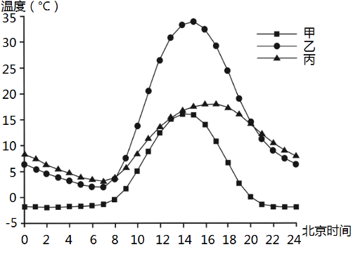

# Testing_case_A1_2

**地气温差是指地表与大气之间的温度差。下图为“我国某城市测站某年日平均地温、气温和地气温差的变化统计图”。据此完成下面小题。**

4．甲、乙、丙分别表示（   ）

A．地气温差地表温度大气温度  

B．地表温度地气温差大气温度

C．大气温度地气温差地表温度  

D．地气温差大气温度地表温度

5．该测站可能位于（   ）

A．北京    B．海南   

C．甘肃    D．黑龙江

6．推测该市一天中污染物浓度最低的时段为（   ）

A．日出前后  B．正午前后 

C．傍晚前后  D．午夜前后