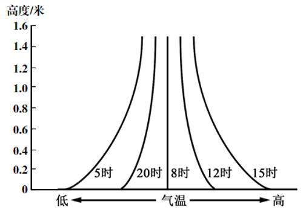

# Testing_case_A1_3

**下图为北半球中纬度某地某日5次观测到的近地面气温垂直分布示意图。当日天气晴朗，日出时间为5时。读图回答问题。**

7．由图中信息可分析出（   ）

A．5时、20时大气较稳定

B．12时、15时出现逆温现象

C．大气热量直接来自太阳辐射

D．气温日较差自下而上增大

8．当地该日（   ）

A．日落时间为17时

B．与海口相比白昼较长

C．正午地物影子年内最长

D．正午太阳位于正北方