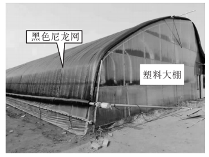

# Testing_case_A1_4

**为了实现对农作物的保温和防晒，绍兴地区部分农民在白色塑料大棚上加一层可收放的黑色尼龙网，如图所示。据此完成下面小题。**

9．图中塑料薄膜和黑色尼龙网直接影响的辐射分别是（   ）

A．地面辐射、太阳辐射   B．太阳辐射、地面辐射

C．太阳辐射、太阳辐射   D．地面辐射、大气辐射

10．若天气晴朗，农民盖上黑色尼龙网的时段多在（   ）

A．春季的晚上  B．夏季正午前后  C．秋季的早晨  D．冬季的傍晚