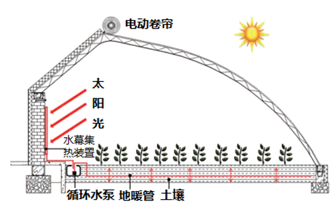

# Testing_case_A1_6

**风沙肆虐的沙漠一直是蔬果生产的禁区，日光温室可以极大地改变这一现状。南疆地区早期建成的温室，普遍存在着冬季夜间室内冻害时常发生的问题。水幕集热-地暖加温系统的应用，较好地解决了这一难题。研究表明，日光温室后墙白天接受太阳总辐射约占温室接收太阳总辐射的50%~60%，夜间，室内获得的热量中墙面放热量约占1/3，地面放热量约占2/3。此外，土壤夜间放热性能较为稳定，受气候条件影响小。**

（1）指出沙漠温室的主要功能。（4分）

 

 

 

（2）简述温室建设厚实后墙的作用。（6分）

 

 

 

 

（3）解释水幕集热-地暖加温系统能减轻冻害问题的原因。（6分）

 

 

 

 

（4）电动卷帘可以根据温度高低对玻璃进行择时覆盖。根据沙漠地区的气温变化分析电动卷帘覆盖的时间。（4分）

 

 

 

 