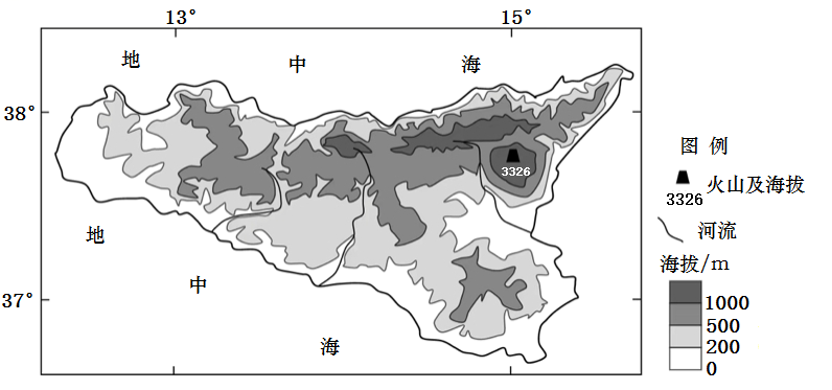

# Testing_case_A1_8

**西西里岛是地中海最大的岛屿，面积为2.57万km²，人口约有527万。岛上东北部的埃特纳火山是欧洲最高活火山，2007年以来已喷发20余次。岛上发展林业的自然条件较好，但时常受森林火灾的困扰。下图为西西里岛地形图。**

（1）述该岛屿的地形特征。（6分）

 

 

 

 

 

 

（2）从大气受热过程分析火山灰导致周边地区昼夜温差减小的原因。（6分）

 

 

 

 

 

（3）西西里岛时常受森林火灾困扰，试对此作出解释。（4分）

 
