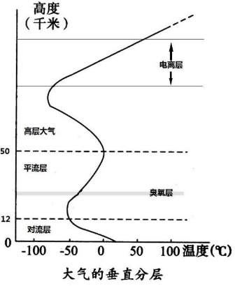

# 大气的垂直分层

## 摘要

大气垂直分层分为对流层、平流层、中气层、增温层、外气层。

其中中气层、增温层与外气层在高中阶段统称为高层大气。

## 知识说明

### 大气的组成

干洁空气中的组成成分为 78% 的氮气、 21% 的氧气，和少量的二氧化碳和臭氧：

- 氮气：地球上生物体的基本元素。
- 氧气：是人类和其他生物维持生命活动所必需的物质
- 二氧化碳：绿色植物进行**光合作用**的基本原料，也是温室气体
- 臭氧：能够吸收紫外线，是大气增温；减少到底地面的紫外线，对生物具有保护作用。

其中还含有少量的水汽与杂质：

- 水汽：水汽能产生云雾雨雪等一系列天气现象，同时伴随着热量的吸收与释放，直接影响地面和大气的温度。
- 杂质：作为凝结核，是成云致雨的必要条件。

### 大气的垂直分层

> 划分大气层，划分依据为：温度、运动状况和密度。

如上图所示，大气被划分为**对流层**、**平流层**、**高层大气**。

***

#### 对流层

低纬度地区为 17 - 18 千米，中纬度地区为 10 - 12 千米，高纬度地区为 8 - 9 千米。

气温随高度的增加而递减；每升高 100 米，气温降低 6 °C。

> 由于地面是对流层的直接热源，所以导致气温随高度而降低。

而对流层主要以对流运动为主；天气现象复杂多变。

> 综合以上种种因素，进而导致了对流层气温上冷下热，几乎全部的水汽、杂质都集中在对流层。

与人类关系最密切。

***

#### 平流层

从对流层顶到 50 - 55 千米为平流层。

气温随高度的增加而递增；先是缓慢增加， 30 千米以上迅速增加。

> 在平流层中的臭氧层吸收了紫外线，为平流层增温。

以平流运动为主；天气晴朗；适合高空飞行。

> 综合以上因素，平流层上热下冷，大气平稳，水汽与杂质的含量少，所以天气稳定

臭氧为人类生存环境天然屏障；大气稳定利于航空飞行。

***

#### 高层大气

从平流层顶到 3000 千米。

气温先降低后升高，在 300 千米的高空，可达 10000 °C ；大气密度非常小

有若干电离层，能反射无线电波。

## 其他说明

无。

